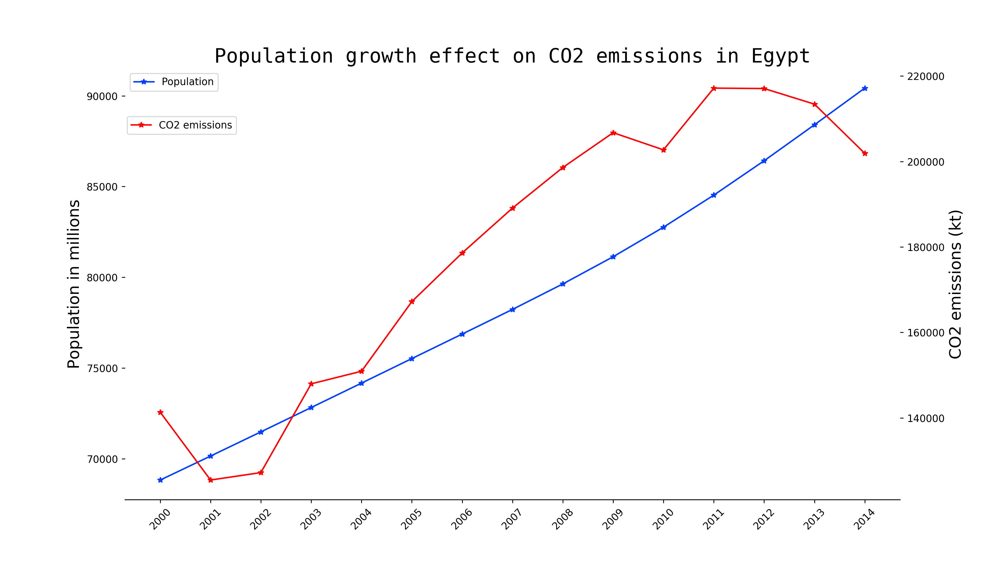
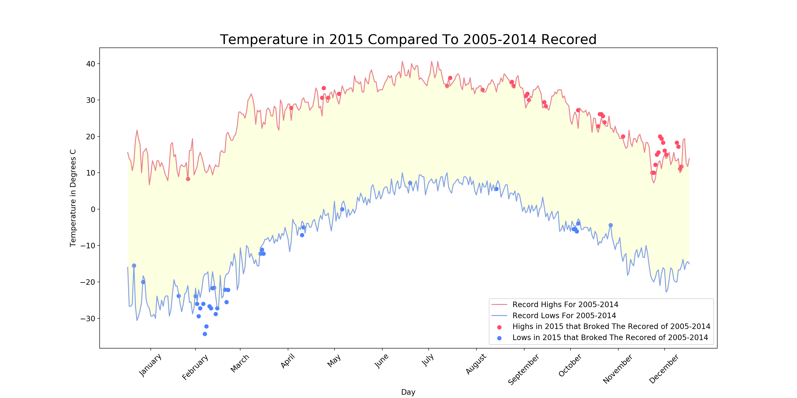
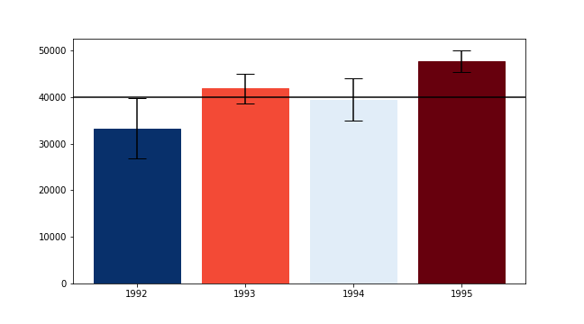
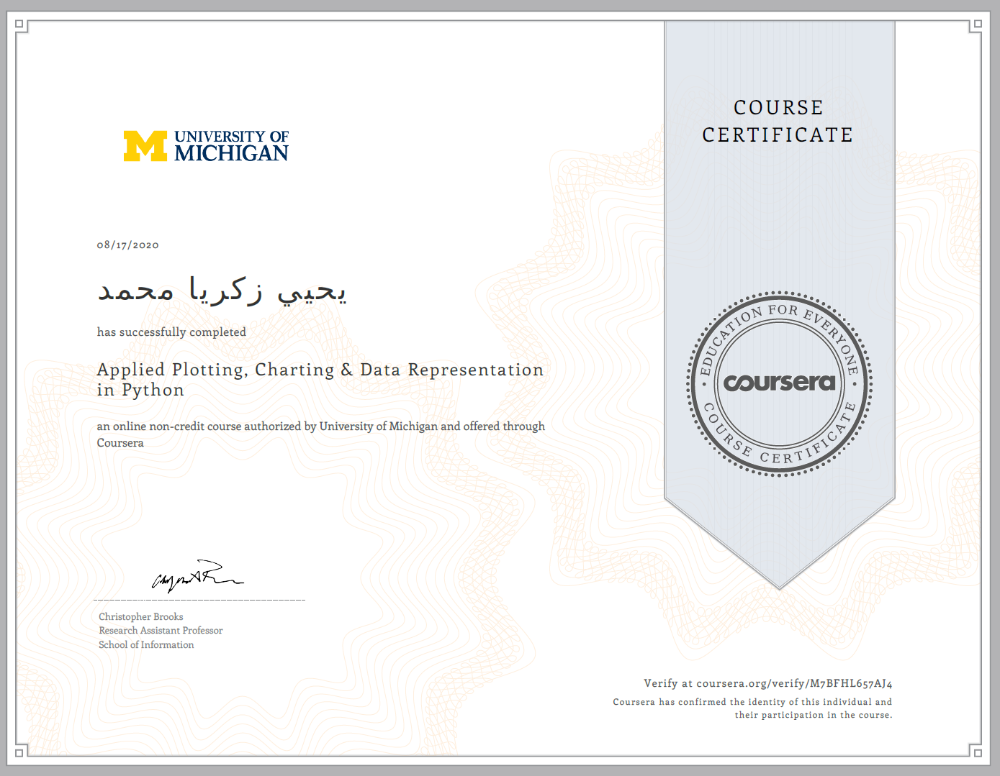

# Become an Independent Data Scientist
this repo contains my final project for the __Applied Plotting, Charting & Data Representation in Python Course__ 
## Skills Used in This Project
* pandas
* matplotlib
* python
* Data Cleaning
* Data Visualization
## Project Stages
* __State a research question:__ My research was in the environment domain on how the population growth affects the CO2 emissions in Egypt
* __Finding 2 Data Sets:__
    * _Egypt Population:_ http://data.un.org/_Docs/SYB/CSV/SYB62_323_201906_Teaching%20Staff%20in%20Education.csv
    * _CO2 Emissions in Egypt:_
    https://databank.worldbank.org/data/download/MDG_csv.zip
* __Data Cleaning__
* __Data Visualization__
## Results

This visual aims to show how population growth affects the CO2 emissions in Egypt by comparing the population to CO2 emissions from 2000 to 2014.
the graphs shows that indeed the population growth increases the CO2 emissions but also we can see that it not the only factor because the correlation between them is not 100%. the visual can be improved by adding other major cities to the study
## Other Assignments Solutions
### Assignment 2
#### Requirements
* Line graph displaying record highs and lows for 2005-2014
* Shaded area between the two lines overlaid scatter plot indicates days in 2015 that broke a record high or low for 2005-2014
* A legend or sufficient labelling for the line graph and scatter plot 
* An accurate title
* Correctly labelled axes  

#### Result

### Assignment 3
#### Requirements
* The bar colors should reflect the bar’s position with respect to the y-axis value (e.g. a gradient ranging from dark blue for the distribution being certainly below this y-axis, to white if the value is certainly contained, to dark red if the value is certainly not contained as the distribution is above the axis).
* Added interactivity that allows the user to click on the y axis to set the value of interestThe bar colors change appropriately with respect to what value the user has selected.  

#### Result

## Course Certificate
